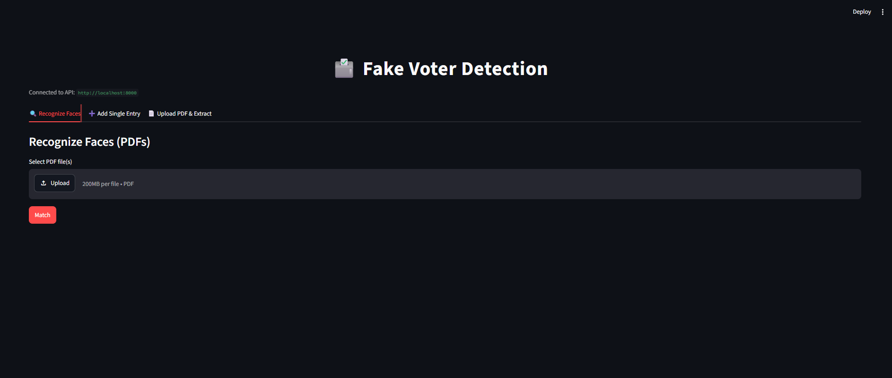
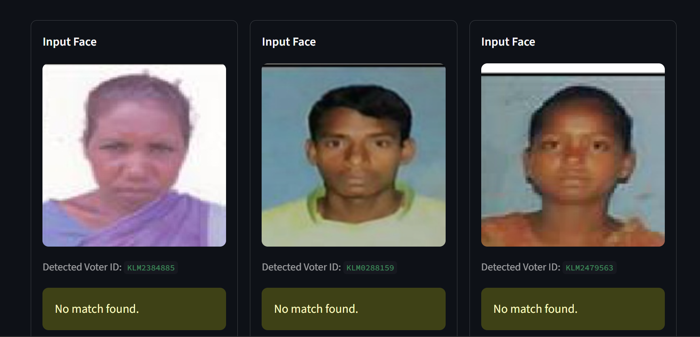
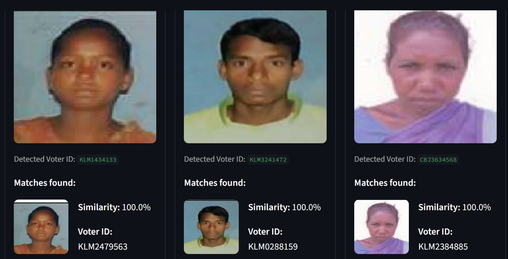
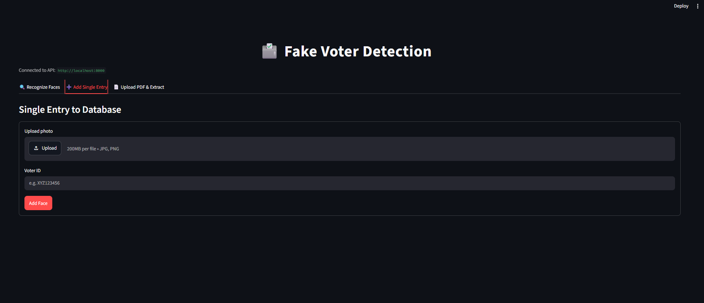
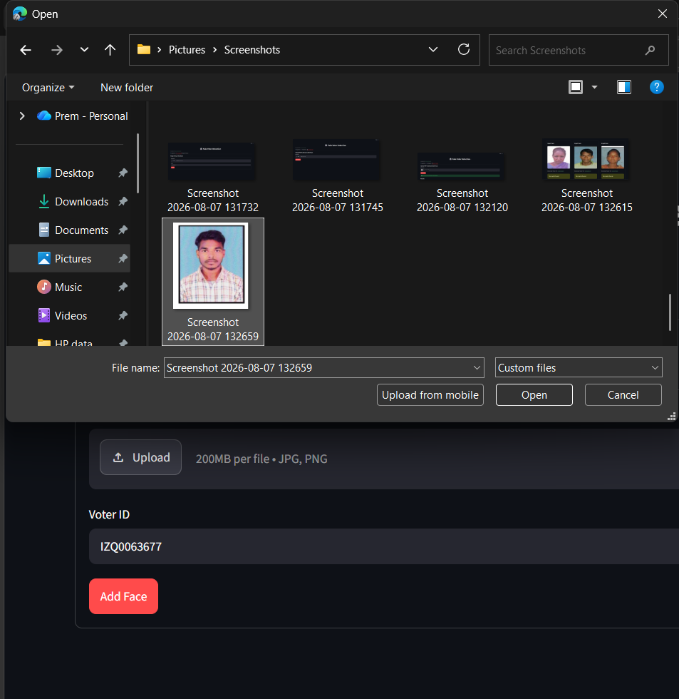
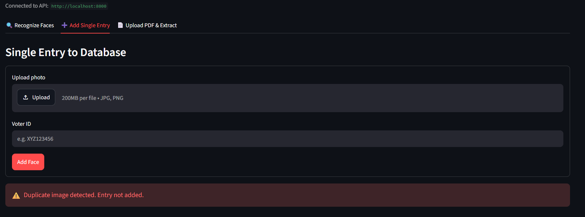
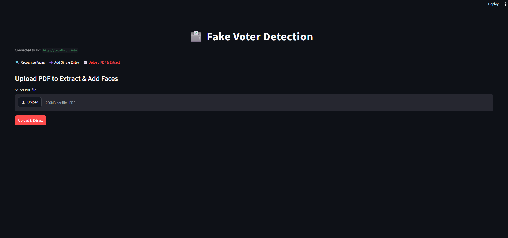
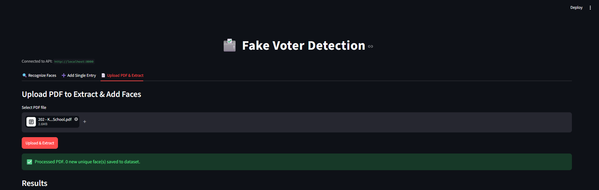

# Duplicate Voter Detection System using Face Recognition

A face-matching pipeline for cross-checking voter photo records — built to flag duplicate or fraudulent entries in voter roll PDFs by comparing detected faces against a known reference dataset.

## Architecture

- **Backend:** FastAPI, with modular pipeline logic split across `utils/` (face detection & embeddings via InsightFace, PDF text/voter-ID extraction via PyMuPDF, CSV/pickle persistence, request validation via Pydantic)
- **Frontend:** Streamlit, calling the backend over HTTP
- **Evaluation:** standalone scripts (`scripts/`) to measure face-verification accuracy against labeled photo pairs, producing ROC/precision-recall/accuracy-vs-threshold charts

```
project/
├── main.py                  # FastAPI app (routes only)
├── requirements.txt
├── utils/
│   ├── config.py              # paths, thresholds, self-healing storage setup
│   ├── schemas.py              # Pydantic request/response validation
│   ├── file_utils.py           # upload validation & saving
│   ├── face_engine.py          # InsightFace model, embeddings, similarity
│   ├── pdf_utils.py             # text-block/voter-ID extraction, face sorting
│   ├── dataset_manager.py       # CSV/pickle persistence
│   └── evaluation.py            # accuracy metrics (ROC, precision/recall, etc.)
├── scripts/
│   ├── generate_pairs.py        # auto-generate labeled pairs.csv from a folder-per-person dataset
│   └── evaluate_accuracy.py     # compute + chart face-verification accuracy
└── frontend/
    └── streamlit_app.py         # UI
```

## Setup

```bash
pip install -r requirements.txt

# Terminal 1 — backend
uvicorn main:app --reload

# Terminal 2 — frontend
streamlit run frontend/streamlit_app.py
```

Interactive API docs (with all request/response validation) are available at `http://localhost:8000/docs`.

### InsightFace model weights

By default, the `buffalo_l` model is downloaded automatically on first run to `~/.insightface/`. To use a model folder you already have locally, set the `INSIGHTFACE_MODEL_ROOT` environment variable to its parent directory (see `utils/config.py` for the expected layout).

## How it works

The app has three workflows, each on its own tab.

### 1. Recognize Faces — match a PDF against the known dataset

Upload one or more PDF documents (e.g. scanned voter rolls). The backend detects every face on every page, reads the nearest voter-ID text via spatial proximity, and checks each face against the known reference dataset.



If no face in the dataset is similar enough, each result is reported as **no match found** — meaning this face hasn't been seen before under any other voter ID.



If a face *does* match an existing dataset entry above the similarity threshold, that's flagged with the similarity score and the voter ID it matches — the core duplicate-detection signal this tool is built around.



### 2. Add Single Entry — register one reference photo

For manually building or extending the known-faces dataset: upload a photo and its Voter ID.





The backend rejects the entry if the photo is a near-duplicate (by embedding similarity) of a face already in the dataset — this is what prevents the same person from being registered twice under different IDs.



### 3. Upload PDF & Extract — bulk-register new faces from a document

Extracts every face on every page of a PDF, pairs each with its nearest voter-ID text, and automatically registers any face that has **no existing match** — building out the reference dataset in bulk rather than one photo at a time.





## Known limitations affecting matching accuracy

Real-world testing surfaced several factors that limit how reliable the current matching is. These are structural issues with the pipeline as it stands, not just tuning knobs:

1. **Source image quality is low.** Voter-ID photos in scanned PDFs are heavily compressed and rasterized at a small physical size — after face cropping, many faces are only a few dozen pixels across before being upscaled to 224×224. Embeddings computed from this degraded, upscaled detail are inherently less discriminative than embeddings from a sharp original photo.

2. **The similarity threshold (55%) is an assumed default, not an empirically validated one.** It was never tuned against labeled ground-truth pairs (see `scripts/evaluate_accuracy.py`) — it's a starting guess carried over from the original implementation. The true optimal threshold for this specific photo domain may sit meaningfully higher or lower; until it's measured, both false matches and missed matches are more likely than they should be.

3. **The model is a general-purpose pretrained network (`buffalo_l`), not fine-tuned for this domain.** It was trained on typical consumer face-image datasets — not on flash-lit, plain-background, photocopier-quality ID photos like these. Its embeddings are less reliable on a distribution this far from its training data.

4. **There's no face-quality filtering.** Blurry, off-angle, partially occluded, or poorly lit faces are still detected, embedded, and compared exactly like clean frontal shots — a bad detection quietly degrades the whole match rather than being flagged or excluded.

5. **The reference dataset is currently small.** With few identities and few photos per identity, similarity-score statistics (and any threshold chosen from them) are not yet statistically robust — accuracy numbers on a small dataset can look better or worse than they'd hold up to at scale.

**To quantify this precisely instead of relying on impressions:** run the accuracy evaluation described below on a labeled test set built from your own data, and check `evaluation_results/score_distribution.png` — if the genuine and impostor score histograms overlap heavily, that visually confirms the model is struggling to separate this specific photo population, and `accuracy_vs_threshold.png` will show whether a different threshold would meaningfully help.


The underlying model (`buffalo_l`) is pretrained, not trained by this project — what's measured instead is the pipeline's **verification accuracy**: given the configured similarity threshold, how well does it correctly identify "same person" vs "different person" on a labeled test set.

```bash
# 1. Organize test photos: one folder per person, 2+ photos each
#    test_dataset/person_01/photo1.jpg, photo2.jpg, ...

# 2. Auto-generate labeled pairs from that structure
python scripts/generate_pairs.py --dataset test_dataset --output pairs.csv

# 3. Compute embeddings, similarity scores, and accuracy charts
python scripts/evaluate_accuracy.py --pairs pairs.csv --output evaluation_results
```

This produces an ROC curve, a similarity score distribution (genuine vs. impostor), a precision-recall curve, an accuracy-vs-threshold sweep, a confusion matrix, and a `metrics_summary.json` — saved to `evaluation_results/`.

## Notes on data privacy

Voter photos, IDs, and face embeddings generated while running this app are **not** committed to this repository (see `.gitignore`) — only the application code is version-controlled. Screenshots above may show sample/test data used during development.
